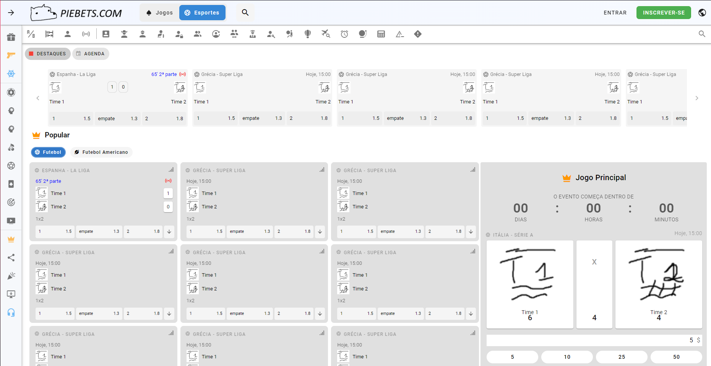

# site-bets-exemplo

Frontend de um site de bets feito como exercício.



## TODO

- Overlay do site/portal
    - ~~Navbar horizontal~~
    - ~~Navbar vertical~~
    - ~~Footnote~~
- Aplicação (/sport)
    - Layout
    - Navbar do app
    - Página principal
        - Abas da página principal
        - Display de jogos futuros
        - Display de jogos
            - Abas do display
            - Cartões de jogos
            - Cartão de jogo principal
            - Cartão de combinações populares
            - Cartão de competição principal
    - Scaling correto por limiares

## Project Setup

```sh
npm install
```

### Compile and Hot-Reload for Development

```sh
npm run dev
```

### Type-Check, Compile and Minify for Production

```sh
npm run build
```

### Lint with [ESLint](https://eslint.org/)

```sh
npm run lint
```
